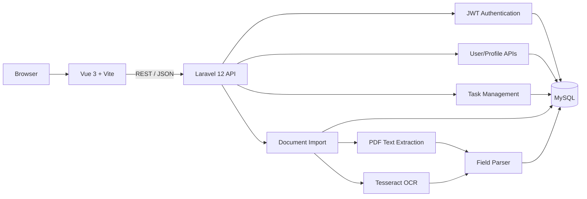

<div align="center">

# User Task API

### Role-Based Task Management & Document Import Platform

**Laravel 12 · PHP 8.2 · Vue 3 · JWT · MySQL · Pinia · Axios**

A full-stack API project demonstrating authentication, role-based task workflows, user-specific authorization, and PDF/image data extraction through a Laravel backend and Vue frontend.

<p>
  
  
  
  
  
</p>

</div>

---

## Overview

**User Task API** is a full-stack task-management application built around a Laravel REST API and a Vue 3 client.

The project demonstrates several practical backend and frontend concerns in one repository:

- JWT authentication
- role-based authorization
- admin vs user task workflows
- user profile access
- task filtering and updates
- PDF / image upload
- text extraction
- OCR fallback
- structured field parsing
- relational database persistence
- Vue route guards
- Pinia-based auth state
- Axios request / response interception

The repository is useful as engineering evidence for **REST API design, authorization boundaries, file-processing workflows, relational modeling, frontend state management, and backend/frontend integration**.

---

## Architecture



---

## Backend Stack

The backend is located in:

```text
User-Task-Api/
```

Verified backend technologies include:

- **PHP 8.2+**
- **Laravel 12**
- **tymon/jwt-auth 2.2**
- **PHPUnit 11**
- **Smalot PDF Parser**
- **Spatie PDF-to-Text**
- **Tesseract OCR integration**
- **MySQL-oriented environment configuration**

The backend uses Laravel's Eloquent ORM for users, tasks, and imported records.

---

## Frontend Stack

The frontend is located in:

```text
api-frontend/
```

Verified frontend technologies include:

- **Vue 3.5**
- **Vue Router 4**
- **Pinia 3**
- **Axios 1.11**
- **Vite 7**
- **Tailwind CSS 4 tooling**

The application includes separate task views for administrators and regular users.

---

## Authentication

Authentication uses JWT through `tymon/jwt-auth`.

### Public auth routes

```http
POST /api/auth/register
POST /api/auth/login
```

Both public auth endpoints are rate limited in the route definition.

### Protected auth routes

```http
POST /api/auth/logout
POST /api/auth/refresh
```

Protected API routes use:

```text
auth:api
```

The configured API guard uses the JWT driver.

### User payload

Successful authentication returns a limited user payload containing:

- id
- name
- email
- role

The model hides the password field, and password assignment is hashed through the model mutator.

---

## Role-Based Authorization

The project uses two primary roles:

- `admin`
- `user`

Authorization rules are enforced in the backend, not only in the UI.

### Admin capabilities

Admins can:

- view all tasks
- create tasks
- assign tasks to non-admin users
- edit full task metadata
- reassign tasks
- delete tasks
- access the user list

### User capabilities

Regular users can:

- view only their assigned tasks
- view an individual task only when assigned to them
- update task status
- update task description

The backend explicitly rejects unauthorized access with 401/403 responses.

---

## Task Domain

The `Task` model contains:

- title
- description
- status
- priority
- due date
- assignee
- creator

Supported task states:

```text
todo
in_progress
done
```

Supported priorities:

```text
low
medium
high
```

The model also contains helpers/scopes for:

- filtering by user
- filtering by status
- filtering by priority
- formatted due dates
- overdue detection

---

## Task API

Protected task routes include:

```http
GET    /api/tasks
POST   /api/tasks
GET    /api/tasks/{id}
PUT    /api/tasks/{id}
DELETE /api/tasks/{id}
```

### Access behavior

- admins see all tasks
- regular users see only their assigned tasks
- admins create and delete tasks
- regular users are limited to their own task status / description updates
- assignment to an admin account is explicitly blocked

The list endpoint also accepts status and priority filters.

---

## User APIs

Protected profile/user routes include:

```http
GET /api/me
PUT /api/me
GET /api/users
```

The user APIs support:

- fetching the authenticated user's profile
- updating the authenticated user's data
- administrative user listing

---

## Document Import Pipeline

One of the more distinctive parts of the project is the document-import workflow.

Authenticated users can upload:

- PDF
- JPG
- JPEG
- PNG

through:

```http
POST /api/import
```

### Processing flow

```text
Uploaded document
      ↓
File validation
      ↓
Local storage
      ↓
TextExtractorService
      ↓
PDF text extraction
      ↓ if text is effectively empty
Tesseract OCR fallback
      ↓
FieldParserService
      ↓
Structured fields
      ↓
ImportedRecord database row
```

### Parsed fields

The parser attempts to extract:

- name
- email
- phone
- address
- city
- state
- ZIP/postal code
- date of birth
- gender
- occupation

The parser uses regular-expression rules over normalized extracted text.

---

## Vue Application

The Vue client includes routes for:

- login
- registration
- admin task management
- user task management

### Route protection

Vue Router navigation guards check:

- whether the user is authenticated
- whether the authenticated role matches the route

Users are redirected to the appropriate admin or user task view.

### Auth state

Pinia manages:

- authenticated user
- JWT token
- loading state
- authentication errors

Auth state is restored from local storage when initialized.

### Axios integration

The shared Axios client:

- attaches the Bearer token automatically
- handles authentication failures
- handles forbidden responses
- normalizes validation errors
- clears local auth state on 401 responses

---

## Admin Task Interface

The admin Vue view includes:

- task listing
- user assignment
- task creation
- task editing
- status management
- priority management
- due dates
- task deletion

The UI loads users separately and prevents selecting admin accounts as assignees.

---

## User Task Interface

The user-facing task view includes:

- assigned task list
- status filtering
- priority filtering
- priority badges
- due dates
- overdue indication
- status changes
- description editing

These controls map to the more restricted update behavior enforced by the Laravel backend.

---

## API Summary

### Public

```http
POST /api/auth/register
POST /api/auth/login
```

### Authenticated

```http
POST /api/auth/logout
POST /api/auth/refresh

GET  /api/me
PUT  /api/me

GET  /api/users

GET    /api/tasks
POST   /api/tasks
GET    /api/tasks/{id}
PUT    /api/tasks/{id}
DELETE /api/tasks/{id}

POST /api/import
```

---

## Repository Structure

```text
User-Task-API_Project/
├── README.md
├── package.json
├── node_modules/                 # tracked legacy artifact; cleanup required
│
├── User-Task-Api/
│   ├── app/
│   │   ├── Http/
│   │   │   └── Controllers/
│   │   ├── Models/
│   │   └── Services/
│   ├── config/
│   ├── database/
│   │   └── migrations/
│   ├── routes/
│   │   └── api.php
│   ├── tests/
│   │   ├── Feature/
│   │   └── Unit/
│   ├── composer.json
│   └── .env.example
│
└── api-frontend/
    ├── src/
    │   ├── router/
    │   ├── stores/
    │   ├── plugins/
    │   └── views/
    ├── package.json
    └── vite.config.js
```

---

## Local Development

### Prerequisites

- PHP 8.2+
- Composer
- MySQL
- Node.js
- npm
- Tesseract OCR for image OCR
- PDF-to-text tooling for the PDF extraction path

### 1. Clone

```bash
git clone https://github.com/Shahriyar-Kh/User-Task-API_Project.git
cd User-Task-API_Project
```

### 2. Backend

```bash
cd User-Task-Api
composer install
cp .env.example .env
php artisan key:generate
php artisan jwt:secret
```

Configure database values in `.env`, then:

```bash
php artisan migrate
php artisan serve
```

The default local Laravel server is typically available at:

```text
http://127.0.0.1:8000
```

### 3. Frontend

From another terminal:

```bash
cd api-frontend
npm install
npm run dev
```

---

## Example Environment Configuration

The backend template currently expects MySQL-oriented variables:

```env
APP_NAME=UserTaskAPI
APP_ENV=local
APP_KEY=
APP_URL=http://localhost

DB_CONNECTION=mysql
DB_HOST=127.0.0.1
DB_PORT=3306
DB_DATABASE=user_task_db
DB_USERNAME=root
DB_PASSWORD=replace-me

JWT_SECRET=
API_RATE_LIMIT=60
```

Never commit real production secrets.

---

## Testing Status

The Laravel project contains both **Feature** and **Unit** test files covering areas such as:

- authentication
- task operations
- admin authorization
- users
- document import
- field parsing

Run the Laravel test command with:

```bash
cd User-Task-Api
composer test
```

or:

```bash
php artisan test
```

### Current test-suite caveat

During this repository audit, several test expectations were found to be out of sync with current controller behavior.

Examples include differences around:

- `token` vs `access_token` response keys
- who is allowed to create/delete tasks
- expected admin route paths
- import response shape

For that reason, this README does **not** claim that the current test suite passes end to end.

This is an important follow-up cleanup item before presenting the test suite as CI-grade evidence.

---

## Repository Hygiene Follow-Up

A root-level `node_modules/` directory is currently tracked in the repository.

That should be removed from version control and protected with a root `.gitignore`.

Additional cleanup should also consolidate redundant frontend API-client files and replace hard-coded localhost URLs with one environment-driven API base.

These are repository-quality improvements, not features of the application itself.

---

## Engineering Evidence for Reviewers

Useful implementation entry points include:

- `User-Task-Api/routes/api.php` — API surface
- `User-Task-Api/app/Http/Controllers/AuthController.php` — JWT auth
- `User-Task-Api/app/Http/Controllers/TaskController.php` — authorization and task workflows
- `User-Task-Api/app/Models/Task.php` — task domain model
- `User-Task-Api/app/Services/TextExtractorService.php` — PDF/OCR extraction
- `User-Task-Api/app/Services/FieldParserService.php` — structured text parsing
- `User-Task-Api/app/Http/Controllers/ImportController.php` — upload/import orchestration
- `api-frontend/src/stores/auth.js` — frontend auth state
- `api-frontend/src/router/index.js` — role-aware route guards
- `api-frontend/src/views/AdminTasksView.vue` — admin workflow
- `api-frontend/src/views/UserTasksView.vue` — user workflow

---

## Portfolio Positioning

This repository is best read as evidence of **software-engineering breadth**:

- REST API architecture
- authentication
- authorization
- CRUD workflows
- relational data modeling
- file processing
- OCR integration
- Vue frontend integration

It is a Laravel/Vue project rather than a Python/Django project, so it complements—rather than replaces—the Python-focused repositories in the broader portfolio.

---

## Author

**Shahriyar Khan**  
Software Engineer · Full-Stack Python Developer

**Primary portfolio focus:** Python · Django · Django REST Framework · FastAPI · React · PostgreSQL

- GitHub: [@Shahriyar-Kh](https://github.com/Shahriyar-Kh)
- Portfolio: [shahriyarkhan.com](https://shahriyarkhan.com)
- LinkedIn: [Shahriyar Khan](https://www.linkedin.com/in/shahriyar-khan-developer/)

---

<div align="center">

**REST APIs · JWT · role-based authorization · task workflows · document processing · Vue integration**

</div>
